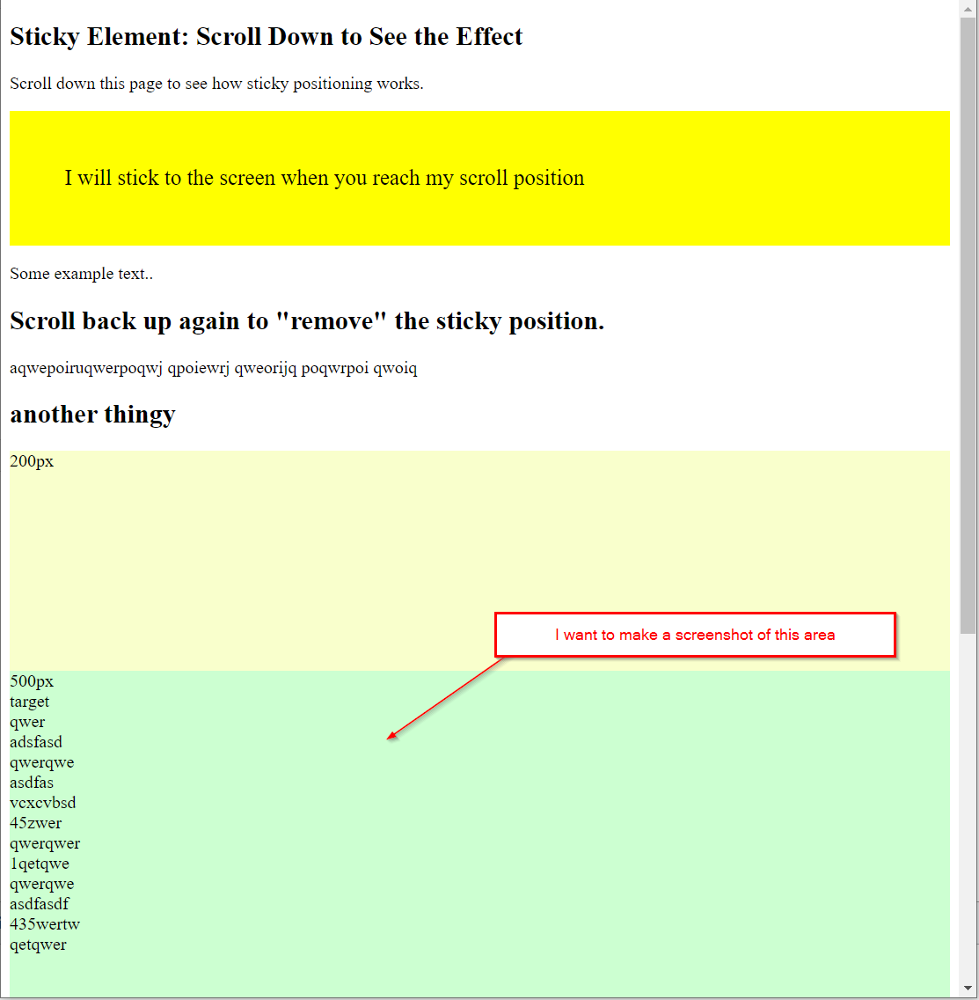
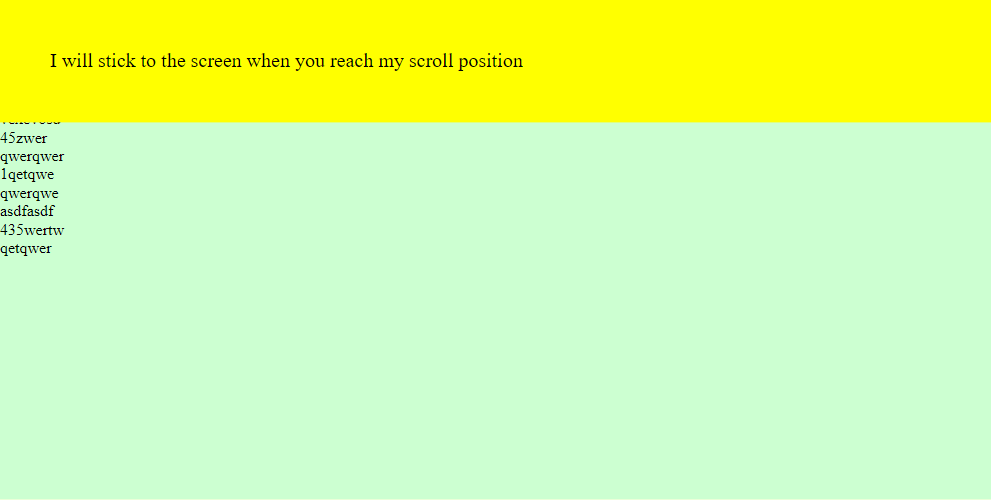

# Problem

I want to make a screenshot of an element on a page, where a sticky element exists

## Page Under Test

[pageundertest.html](./pageundertest.html) has a sticky element. I want to screenshot an element on the page, that is below that sticky element.

You can reach the page here: [https://htmlpreview.github.io/?https://github.com/schrufygroovy/chromiumdevtoolsscreenshotbug/blob/master/pageundertest.html](https://htmlpreview.github.io/?https://github.com/schrufygroovy/chromiumdevtoolsscreenshotbug/blob/master/pageundertest.html)

See: 

## Actual Wrong Result

When I do a screenshot of it using node.js (see: [index.js](./index.js))
```
node index.js
```

Then the sticky element is ALWAYS on top of the element I want to screenshot. I have no possibility to work around this:

See: 